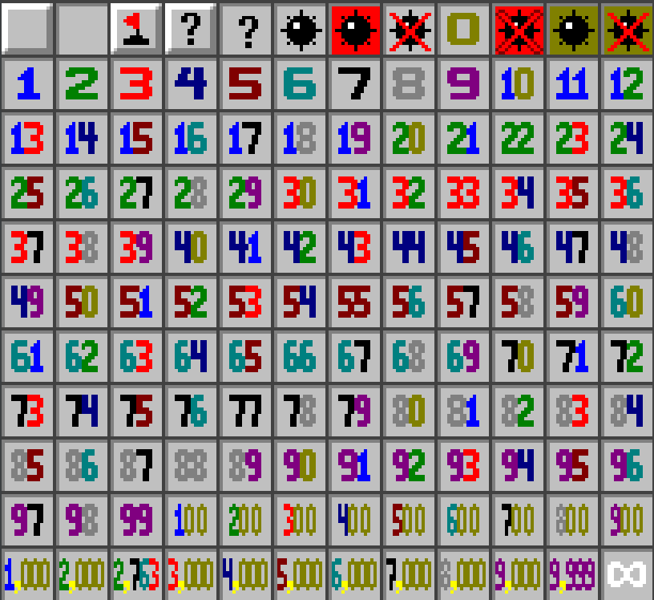

# 🧠 Minesweeper Backtracking Visualizer

A graphical Minesweeper puzzle solver built in C++ using the [Malena](https://github.com/daversmith/Malena) framework and SFML.  
This project visually demonstrates how a backtracking algorithm can be used to find a valid mine placement that satisfies all numbered tiles on a Minesweeper board.



---

## ✨ Features

- 🎯 **Backtracking Solver**: Recursively finds a valid mine placement.
- 🧩 **Visual Animation**: Highlights step-by-step recursive exploration and flag placements.
- 💡 **Custom Textures**: Each tile updates its image based on state (e.g., mine, number, flag, blank).
- 🖱️ **Interactive Testing**: Click tiles to simulate gameplay-like behavior (blank/mine reveals).
- 🔧 **Modular Design**: Clean separation of logic: `Board`, `Node`, `BackTracking`, `Highlighter`.

---

## 📁 Project Structure

```
.
├── src/                # C++ source files
│   ├── Board.cpp/.h
│   ├── BackTracking.cpp/.h
│   ├── Highlighter.cpp/.h
│   ├── TileSprite.cpp/.h
│   ├── Node.cpp/.h
│   ├── MinesweeperApp.cpp/.h
│   └── main.cpp
├── Image/              # Minesweeper tile texture sheet (minesweep_cut.png)
├── CMakeLists.txt      # Build configuration
├── CMakePresets.json   # Compiler & build setup
└── README.md
```

---

## 🚀 How to Build

### ✅ Prerequisites

- C++17 or later
- [CMake](https://cmake.org/download/)
- [SFML](https://www.sfml-dev.org/) (linked via Malena)
- Git

### 🔧 Setup & Compile

```bash
# Clone repository
git clone https://github.com/your-username/Minesweeper_Backtracking.git
cd Minesweeper_Backtracking

# Configure build (using CMake presets)
cmake --preset="GCC 14.2.0 x86_64-w64-mingw32 (ucrt64)"

# Build
cmake --build --preset="GCC 14.2.0 x86_64-w64-mingw32 (ucrt64)"

# Run executable
./out/build/GCC*/Minesweeper_Backtracking
```

---

## 🧪 Try it without building

To try the visualizer instantly:

1. Go to the [Releases page](https://github.com/your-username/Minesweeper_Backtracking/releases)
2. Download the `.zip` file
3. Extract it and run `Minesweeper_Backtracking.exe`

✅ No compilation required.

---

## 🎨 Tile States

| Number | Meaning                | Texture Position |
|--------|------------------------|------------------|
| `0–5`  | Numbered tile          | `(1,0)` to `(1,4)` |
| `-1`   | Flagged tile           | `(0,2)`           |
| `-2`   | Clicked blank tile     | `(0,3)`           |
| `-6`   | Mine explosion         | `(0,6)`           |

---

## 🧠 Algorithm Overview

The solver uses recursive **backtracking** to explore all valid flag combinations around numbered tiles:

- Valid flag placements must not violate any number tile.
- The solver builds an animation script (`step + flagStep`) as it explores.
- This script is played by the `Highlighter` class to visualize the solving process.

---

## 📜 License

MIT License. See `LICENSE.md`.

---

## 🙌 Acknowledgements

- Built with [Malena](https://github.com/daversmith/Malena) by [@daversmith](https://github.com/daversmith)
- Developed by Hongbo Zhou
